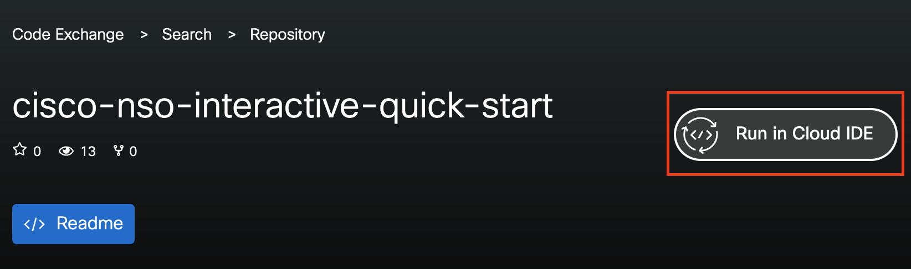

# Cisco NSO Interactive Quick Start

Explore and experiment with the world of NSO on Cisco Code Exchange, where you can dive right in and try out examples in a user-friendly browser-based integrated development environment (IDE).

But wait, there's more! You can also contribute your examples and share them with everyone. The best part is your peers can play with your examples without installing anything.

To start the environment, click on the **Run in Cloud IDE** button on the right side of the Repo title.



## How can I add my own example?

1. Simply submit your repo on <https://developer.cisco.com/codeexchange/submit/>
2. Once your submission is approved, your repository will be featured on the [Cisco Cloud IDE](https://developer.cisco.com/codeexchange/search/?complexity=devenv)
3. That's it! Now you can start exploring, playing, and sharing your awesome examples. Let the creativity flow!

## Need an example?

This short example will demonstrate how to set up a simulated network of Cisco IOS routers and manage these with NSO in Code Exchange Cloud IDE. NSO will talk Cisco CLI towards the routers.

Prepare NSO

```bash
source $NCS_DIR/ncsrc
ncs-netsim --dir ~/example/netsim create-network cisco-ios-cli-3.8 2 ios
ncs-setup --dest ~/example --netsim-dir ~/example/netsim
cd ~/example/
ncs-netsim start
ncs
ncs --version
ncs --status | grep -i status
```

Configure NSO

```bash
ncs_cli -C -u admin
devices sync-from
config
show full-configuration devices device ios1 config | nomore
devices device ios0 config
ios:hostname nso.cisco.com
top
commit dry-run outformat native
commit
```

### Explore and play with the NSO Example Collection

Go to `$NCS_DIR` > `examples.ncs` in the VS Code workspace or use the terminal

```bash
cd $NCS_DIR/examples.ncs/
developer:examples.ncs > ll
total 28
drwxr-xr-x 1 developer ncsadmin   267 Jun 28 11:38 .
drwx------ 1 developer ncsadmin   294 Jul 18 13:33 ..
-rw-r--r-- 1 developer ncsadmin 27052 Jun 28 11:38 README
drwxr-xr-x 1 developer ncsadmin    27 Jun 28 11:05 crypto
drwxr-xr-x 1 developer ncsadmin    36 Jun 28 11:05 datacenter
drwxr-xr-x 1 developer ncsadmin   261 Jun 28 11:38 development-guide
drwxr-xr-x 1 developer ncsadmin    27 Jun 28 11:05 generic-ned
drwxr-xr-x 1 developer ncsadmin    50 Jun 28 11:05 getting-started
drwxr-xr-x 1 developer ncsadmin    26 Jun 28 11:05 high-availability
drwxr-xr-x 1 developer ncsadmin    69 Jun 28 11:05 misc
drwxr-xr-x 1 developer ncsadmin   143 Jun 28 11:05 service-provider
drwxr-xr-x 1 developer ncsadmin    19 Jun 28 11:05 snmp-ned
drwxr-xr-x 1 developer ncsadmin   155 Jun 28 11:38 snmp-notification-receiver
drwxr-xr-x 1 developer ncsadmin    53 Jun 28 11:05 web-server-farm
drwxr-xr-x 1 developer ncsadmin    31 Jun 28 11:05 web-ui
```

## Guidelines

- Code shared is public, **avoid any confidential information.**

## Recommendations

- It is recommended to avoid specifying NSO versions in the code, as the underlying NSO will be upgraded with newer releases.

## FAQ

- What NSO install type is used?
  - NSO local install. But System install is in the pipeline.
- What NEDs come with the container?

  - Example NEDs. These should be considered as examples. NEDs in the container are only used to run the simulated networks. Do not use these with real devices.

    ```bash
    developer:~ > ls -1 $NCS_DIR/packages/neds/
    a10-acos-cli-3.0
    alu-sr-cli-3.4
    cisco-asa-cli-6.6
    cisco-ios-cli-3.0
    cisco-ios-cli-3.8
    cisco-iosxr-cli-3.0
    cisco-iosxr-cli-3.5
    cisco-nx-cli-3.0
    dell-ftos-cli-3.0
    juniper-junos-nc-3.0
    developer:~ > ls -1 $NCS_DIR/packages/neds/ | wc -l
    10
    developer:~ >
    ```

- My code is approved, but I don't see it?
  - Expand the `/home/developer/src` in the workspace
  - or do `ls -l /home/developer/src`
